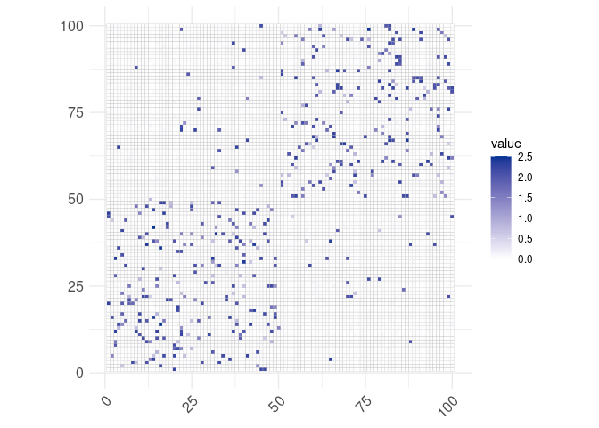

<!-- README.md is generated from README.Rmd. Please edit that file -->

# VIMuRe

<!-- badges: start -->
<!-- badges: end -->

Latent Network Models to Account for Noisy, Multiply-Reported Social
Network Data.

If you use this code please cite this article (preprint).

> De Bacco C, Contisciani M, Cardoso-Silva J, Safdari H, Baptista D,
> Sweet T, Young JG, Koster J, Ross CT, McElreath R, Redhead D. Latent
> Network Models to Account for Noisy, Multiply-Reported Social Network
> Data. arXiv preprint
> [arXiv:2112.11396](https://arxiv.org/abs/2112.11396). 2021.

The VIMuRe R package wraps the
[VIMuRe](https://github.com/latentnetworks/vimure/tree/18-vimure-v01-r-write-test_syntheticr/src/python)
Python package. We use the
[`reticulate`](https://rstudio.github.io/reticulate/) package to embeds
a Python session within your R session, enabling seamless,
high-performance interoperability.

## Requirements

Vimure R package depends on R \>= 3.3.0 and it is expect to work fine in
all OS. The package also depends on Python \>= 3.6, but you do not have
to worry about that as we have a default set up that will run the first
time you call `library(vimure)`.

## Installation

You can install the development version of VIMuRe from
[GitHub](https://github.com/) with:

``` r
# install.packages("devtools")
devtools::install_github("latentnetworks/vimure", subdir="src/R", ref="develop")
```

### Default

If reticulate did not find a non-system installation of python you may
be prompted if you want it to download and install miniconda. Miniconda
is the recommended installation method for most users, as it ensures
that the R python installation is isolated from other python
installations. All python packages will by default be installed into a
self-contained conda or venv environment named “r-vimure”. Note that
“conda” is the only supported method on Windows.

If you initially declined the miniconda installation prompt, you can
later manually install miniconda by running
`reticulate::install_miniconda()`

### Set up your own Python Enviroment

If you do not want to install miniconda, you can set up your [Python
enviroment](http://timsherratt.org/digital-heritage-handbook/docs/python-pip-virtualenv/)
manually or by `reticulate::install_python()`. VIMuRe requires Python
\>= 3.6.

## Usage Example

Simply create an object with the desired synthetic network class:

``` r
library(vimure, quietly =T)
#> Using an existing virtualenv (r-vimure)
#> PYTHON_PATH=/home/gabriela-borges/.virtualenvs/r-vimure/bin/python
library(ggplot2, quietly =T)
library(ggcorrplot, quietly =T)
library(igraph, quietly =T)
#> 
#> Attaching package: 'igraph'
#> The following objects are masked from 'package:stats':
#> 
#>     decompose, spectrum
#> The following object is masked from 'package:base':
#> 
#>     union

random_net <- gm_CReciprocity()
Y <- extract_Y(random_net)
```

`vimure` is a R binding of a Python package. Many Python basic objects
are quickly converted to R automatically. Custom Python objects that can
not be converted automatically are stored in R as a
`python.builtin.object`. As a `python.builtin.object`, you can access
all object’s attributes as it is in Python using the dollar sign `$`.

Use the function `class` to check if a object is stored in Python.

``` r
class(random_net)
#> [1] "vimure.synthetic.GMReciprocity"       
#> [2] "vimure.synthetic.StandardSBM"         
#> [3] "vimure.synthetic.BaseSyntheticNetwork"
#> [4] "vimure.io.BaseNetwork"                
#> [5] "python.builtin.object"
```

`random_net` is stored as a Python object. You can access its attributes
using the dollar sign `$` or using our `extract_*` functions which
always will return a R object.

``` r
class(random_net$Y) # still a python object because it is a sptensor
#> [1] "sktensor.sptensor.sptensor" "sktensor.core.tensor_mixin"
#> [3] "python.builtin.object"
class(extract_Y(random_net)) # extract_Y convert to array
#> [1] "array"
```

Create a graph from the adjacency matrix and calculate some network
statistics:

``` r
graph <- graph_from_adjacency_matrix(Y[1, ,], mode = "directed")
paste0(
  "Nodes: ", length(V(graph)),
  " | Edges: ", gsize(graph),
  " | Avg. degree: ", mean(degree(graph)), # TODO: Change to directed graph
  " | Reciprocity: ", reciprocity(graph)
)
#> [1] "Nodes: 100 | Edges: 386 | Avg. degree: 7.72 | Reciprocity: 0.787564766839378"
```

Given a network Y, we can generate N observed adjacency matrices as
would have been reported by reporting nodes 𝑚 ( 𝑚∈𝑁 ). This is achieved
by the function `build_X`. Example:

``` r
X <- build_X(random_net, flag_self_reporter=F, cutoff_X=F, mutuality=0.5, seed=20L)
Xavg <- extract_Xavg(random_net)

ggcorrplot(Xavg[1, ,]) + 
   scale_fill_gradient(low="white",high="#003396")
#> Scale for 'fill' is already present. Adding another scale for 'fill', which
#> will replace the existing scale.
```



## Setup (Development mode)

Use this setup if you want to modify anything in the package. For
reproducibility reasons use the R version 4.1.2.

1.  [Clone the
    repository](https://docs.github.com/en/repositories/creating-and-managing-repositories/cloning-a-repository)
    to a directory in your machine
2.  In prompt, change to `vimure/src/R` directory and open a Rstudio
    session.

``` bash
cd vimure/src/R
rstudio
```

3.  In Rstudio, load the package:

``` r
devtools::install()  # Install the current version of package
```
